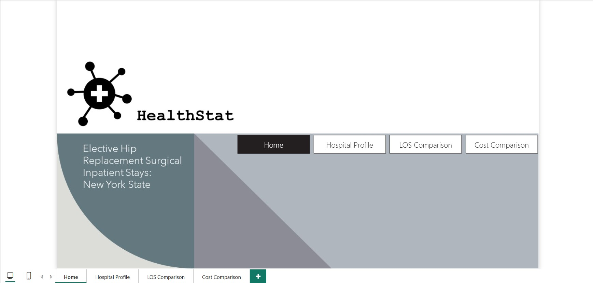
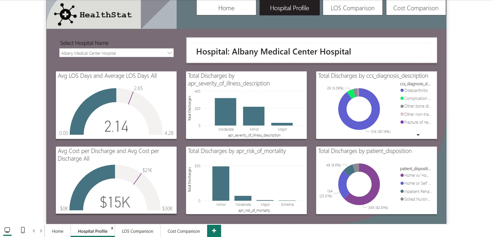
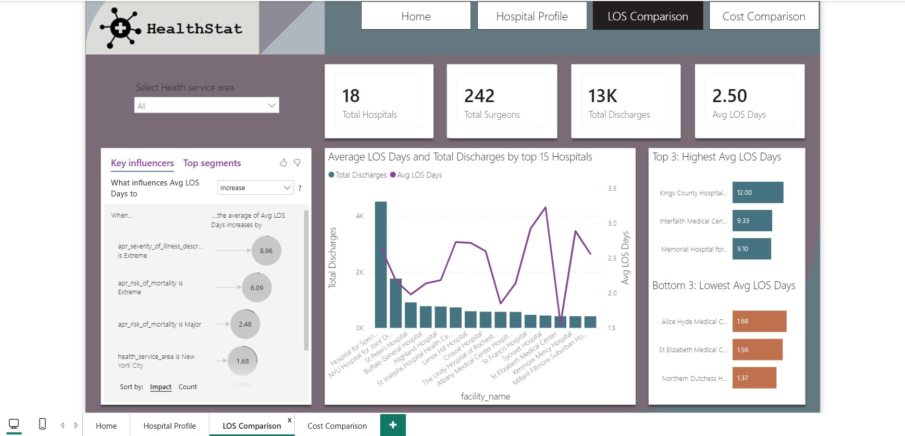
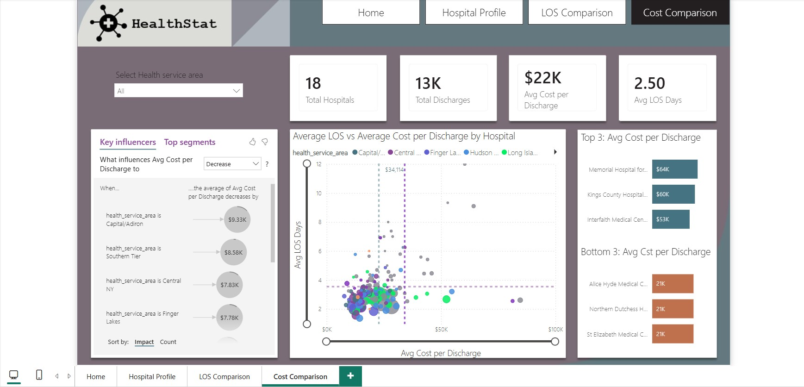

# 🏥 HealthStat — Healthcare Analytics Dashboard

<p align="center">
  <strong>Interactive Power BI dashboard for analyzing hospital performance, patient discharges, length of stay, and healthcare costs across New York State.</strong>
</p>

---

## 📊 Project Overview

**HealthStat** is an interactive healthcare analytics dashboard built with **Microsoft Power BI** to provide a comprehensive view of hospital performance for elective hip replacement surgical inpatient stays across **New York State**.

The dashboard transforms healthcare data into actionable insights by allowing users to explore:

- Hospital performance
- Patient discharge patterns
- Length of Stay (LOS)
- Average cost per discharge
- Severity and risk of illness
- Patient disposition
- Diagnosis distribution
- Differences between hospitals and health service areas

The project is designed around an executive-friendly interface while still providing deeper analytical capabilities for hospital-level investigation.

---

## 🎯 Business Objective

Healthcare organizations need to balance **patient outcomes, operational efficiency, and cost management**.

HealthStat aims to help decision-makers answer questions such as:

- Which hospitals have the highest and lowest average Length of Stay?
- Which hospitals have the highest healthcare costs per discharge?
- How does Length of Stay relate to treatment cost?
- Which health service areas perform differently from others?
- What patient characteristics are associated with longer hospital stays?
- How are patients distributed across different discharge dispositions?
- What factors appear to influence hospital Length of Stay and cost?

---

# 📑 Dashboard Pages

## 1. 🏠 Home

The **Home** page provides an executive-level introduction to the HealthStat dashboard.

It serves as the central navigation point for the report and provides access to the main analytical sections:

- **Home**
- **Hospital Profile**
- **LOS Comparison**
- **Cost Comparison**

The navigation structure allows users to move from high-level exploration into detailed hospital and performance analysis.



---

## 2. 🏥 Hospital Profile

The **Hospital Profile** page provides a detailed view of an individual hospital.

Users can select a hospital from the dropdown and analyze its characteristics and patient outcomes.

### Key metrics

- Average Length of Stay
- Average Cost per Discharge
- Total Discharges
- Diagnosis distribution
- Severity of illness
- Risk of mortality
- Patient disposition

### Example

The dashboard can be filtered to a specific hospital, such as **Albany Medical Center Hospital**, allowing users to investigate its performance in detail.

### Visualizations

- Average LOS gauge
- Average cost per discharge gauge
- Total discharges by severity of illness
- Total discharges by risk of mortality
- Diagnosis distribution
- Patient disposition distribution



---

## 3. 📈 LOS Comparison

The **LOS Comparison** page focuses on **Length of Stay (LOS)** across hospitals and health service areas.

The page combines descriptive analysis with Power BI's **Key Influencers** visual to identify factors associated with changes in average LOS.

### Key Performance Indicators

| KPI | Example Value |
|---|---:|
| Total Hospitals | 18 |
| Total Surgeons | 242 |
| Total Discharges | 13K |
| Average LOS | 2.50 Days |

### Main Analysis

The dashboard compares:

- Average LOS across hospitals
- Total discharges by hospital
- Highest average LOS hospitals
- Lowest average LOS hospitals
- Factors influencing average LOS

The Key Influencers analysis provides additional diagnostic insight into variables such as:

- Severity of illness
- Risk of mortality
- Health service area



---

## 4. 💰 Cost Comparison

The **Cost Comparison** page analyzes the relationship between healthcare costs and Length of Stay.

Users can compare hospitals based on their **Average Cost per Discharge** while simultaneously examining their average LOS.

### Key Performance Indicators

| KPI | Example Value |
|---|---:|
| Total Hospitals | 18 |
| Total Discharges | 13K |
| Average Cost / Discharge | $22K |
| Average LOS | 2.50 Days |

### Main Analysis

The dashboard includes:

- Average Cost vs Average LOS scatter plot
- Hospital-level cost comparison
- Top 3 hospitals by average cost
- Bottom 3 hospitals by average cost
- Key Influencers analysis for average cost

The scatter plot makes it possible to identify hospitals with:

- High cost and high LOS
- High cost but relatively low LOS
- Low cost and low LOS
- Potentially unusual cost/LOS combinations



---

# 📌 Key Metrics

HealthStat focuses on several core healthcare performance indicators:

### 🏥 Hospital Volume
Measures the number of hospitals and surgical activity represented in the dataset.

### 👥 Total Discharges
Tracks the number of inpatient discharges and provides context for hospital activity.

### ⏱️ Average Length of Stay
Measures the average number of days patients remain hospitalized.

### 💵 Average Cost per Discharge
Provides a high-level view of healthcare expenditure associated with each discharge.

### ⚕️ Severity & Mortality Risk
Examines patient distributions across different levels of illness severity and mortality risk.

### 🏠 Patient Disposition
Analyzes where patients go following discharge, such as home, rehabilitation, or skilled nursing facilities.

---

# 🔎 Analytical Approach

The dashboard follows a progression from **overview → profiling → comparison → diagnosis**.

```text
                    HealthStat
                        │
          ┌─────────────┴─────────────┐
          │                           │
       Overview                  Detailed Analysis
          │                           │
       Home Page              ┌───────┴────────┐
                              │                │
                       Hospital Profile   Performance
                              │                │
                              │        ┌───────┴───────┐
                              │        │               │
                              │      LOS             Cost
                              │   Comparison      Comparison
                              │        │               │
                              └────────┴───────────────┘
